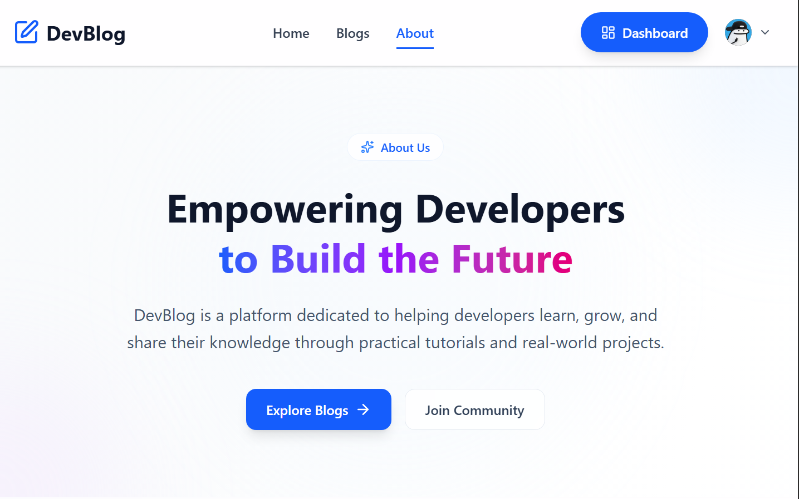
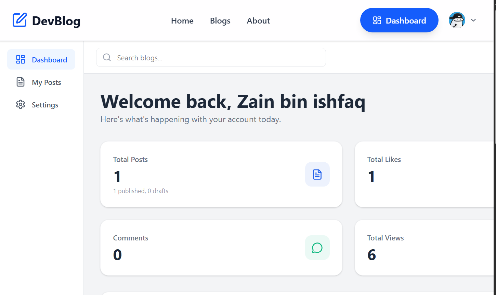
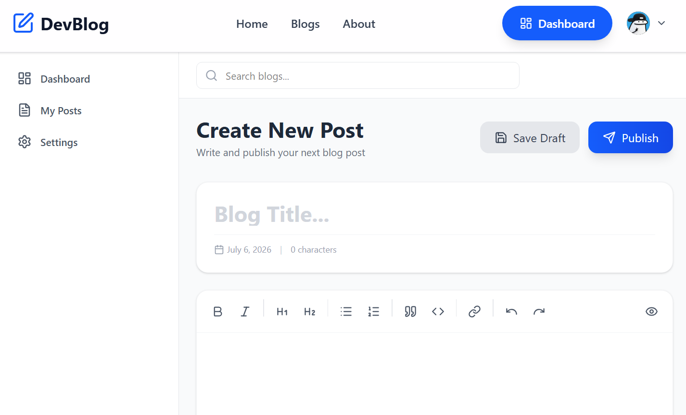

# 📝 DevBlog - Full Stack Blog Application

DevBlog is a full-featured blog platform built with the MERN stack (MongoDB, Express.js, React, Node.js). It allows users to create, read, update, and delete blog posts with a modern and responsive UI.




## ✨ Features

### 👤 Authentication
- User registration with email/password
- User login with JWT authentication
- Password hashing with bcrypt
- Protected routes and private content

### 📝 Blog Management
- Create, read, update, delete blog posts
- Rich text editor (TipTap)
- Image upload support
- Category and tag management
- Like and unlike posts
- Comment on posts

### 📊 Dashboard
- User statistics (posts, likes, views)
- Recent posts management
- Profile editing
- Avatar upload

### 🎨 UI/UX
- Fully responsive design
- Dark/Light mode support (coming soon)
- Smooth animations and transitions
- Modern gradient design
- Mobile-first approach

## 🛠️ Tech Stack

### Frontend
- React 18
- Vite
- Tailwind CSS
- React Router v6
- TipTap Editor
- Lucide Icons
- Axios

### Backend
- Node.js
- Express.js
- MongoDB with Mongoose
- JWT Authentication
- Bcrypt for password hashing
- CORS enabled

### Deployment
- Vercel (Frontend & Backend)
- MongoDB Atlas (Database)

## 📁 Project Structure

```
DevBlog/
├── client/                 # React Frontend
│   ├── src/
│   │   ├── api/           # API configuration
│   │   ├── components/    # Reusable components
│   │   │   ├── blog/      # Blog components
│   │   │   ├── dashboard/ # Dashboard components
│   │   │   ├── editor/    # Editor components
│   │   │   ├── home/      # Homepage components
│   │   │   └── layout/    # Layout components
│   │   ├── context/       # React Context providers
│   │   ├── pages/         # Page components
│   │   ├── services/      # API services
│   │   └── routes/        # Route configuration
│   └── package.json
│
├── server/                 # Node.js Backend
│   ├── config/            # Configuration files
│   ├── controllers/       # Route controllers
│   ├── middleware/        # Custom middleware
│   ├── models/            # MongoDB models
│   ├── routes/            # API routes
│   ├── utils/             # Utility functions
│   ├── index.js           # Entry point
│   └── package.json
│
├── .gitignore
└── README.md
```

## 🚀 Getting Started

### Prerequisites
- Node.js (v14 or higher)
- MongoDB (local or Atlas)
- npm or yarn

### Installation

1. **Clone the repository**
```bash
git clone https://github.com/binishfaq/DevBlog
cd DevBlog
```

2. **Install dependencies**

Frontend:
```bash
cd client
npm install
```

Backend:
```bash
cd server
npm install
```

3. **Environment Variables**

Create a `.env` file in the `server` folder:
```env
PORT=5000
MONGODB_URI=mongodb://localhost:27017/devblog
JWT_SECRET=your_jwt_secret_key
CLIENT_URL=http://localhost:5173
```

Create a `.env` file in the `client` folder:
```env
VITE_API_URL=http://localhost:5000/api
```

4. **Run the application**

Backend:
```bash
cd server
npm run dev
```

Frontend:
```bash
cd client
npm run dev
```

5. **Open your browser**
```
http://localhost:5173
```

## 📡 API Endpoints

### Authentication
| Method | Endpoint | Description |
|--------|----------|-------------|
| POST | `/api/auth/register` | Register new user |
| POST | `/api/auth/login` | Login user |
| GET | `/api/auth/me` | Get current user |
| PUT | `/api/auth/update` | Update user profile |

### Posts
| Method | Endpoint | Description |
|--------|----------|-------------|
| GET | `/api/posts` | Get all posts |
| GET | `/api/posts/my-posts` | Get user's posts |
| GET | `/api/posts/:id` | Get single post |
| POST | `/api/posts` | Create post |
| PUT | `/api/posts/:id` | Update post |
| DELETE | `/api/posts/:id` | Delete post |
| POST | `/api/posts/:id/like` | Like/unlike post |
| POST | `/api/posts/:id/comments` | Add comment |

### Categories
| Method | Endpoint | Description |
|--------|----------|-------------|
| GET | `/api/posts/categories` | Get all categories |
| GET | `/api/posts/categories/all` | Get categories with counts |

## 🤝 Contributing

Contributions are welcome! Please feel free to submit a Pull Request.

1. Fork the repository
2. Create your feature branch (`git checkout -b feature/AmazingFeature`)
3. Commit your changes (`git commit -m 'Add some AmazingFeature'`)
4. Push to the branch (`git push origin feature/AmazingFeature`)
5. Open a Pull Request

## 📄 License

This project is licensed under the MIT License - see the [LICENSE](LICENSE) file for details.

## 👨‍💻 Author

**Zain Bin Ishfaq**

- GitHub: [@binishfaq](https://github.com/binishfaq)
- Email: zainbinishfaq@gmail.com

## 🙏 Acknowledgments

- [React](https://reactjs.org/)
- [MongoDB](https://www.mongodb.com/)
- [Tailwind CSS](https://tailwindcss.com/)
- [TipTap Editor](https://tiptap.dev/)

## 📸 Screenshots

### Homepage


### Blog Details


### Dashboard


### Create Post


---

Made with ❤️ by Zain Bin Ishfaq